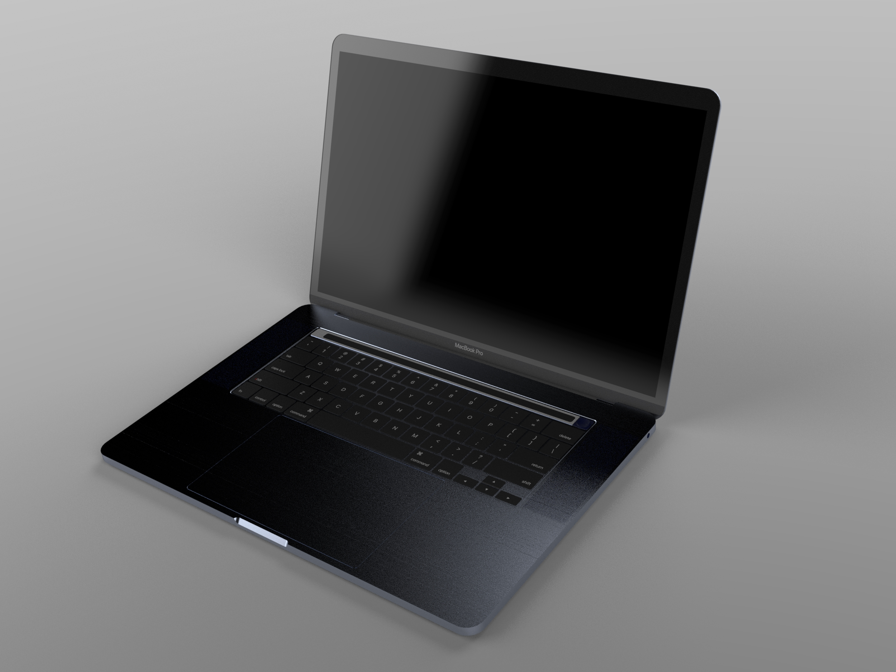
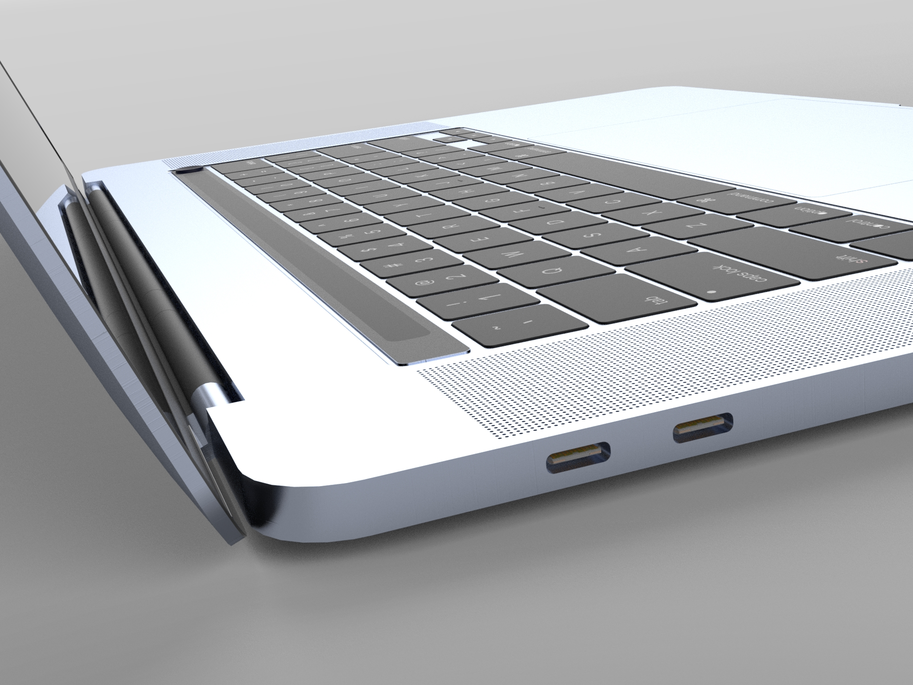

# Apple MacBook Pro M1 (2020)
---

### Description:
# M1 MacBook Pro 2020 Design using SolidWorks

Welcome to the repository showcasing my design of the M1 MacBook Pro 2020 created using SolidWorks. This project includes detailed models, images, and a few assembly video render of the laptop.

## Table of Contents

- [Overview](#overview)
- [Features](#features)
- [Images](#images)
- [Assembly Video](#assembly-video)
- [Design](#Design)

## Overview

In this project, I've utilized SolidWorks to meticulously design and visualize the M1 MacBook Pro 2020. The goal was to create an accurate and detailed representation of a real object in physical world. And as an Apple boy, I chose the MacBook Pro M1 laptop's physical design.

## Features

- **Detailed Model:** The SolidWorks model includes accurate dimensions and features, capturing the essence of the M1 MacBook Pro 2020 design.
- **Realistic Renderings:** I've created renderings showcasing different angles and perspectives of the laptop.
- **Assembly Video Render:** A few video rendering demonstrates the laptop's assembly process, highlighting the arrangement of components.

## Design

The design itself is included as a parasolid file called `MacBook Pro M1.x_t`
## Images

Here are a few rendered images of the designed M1 MacBook Pro 2020:

## Assembly Video

Check out the assembly process of the M1 MacBook Pro 2020 in `Video Render` directory.

